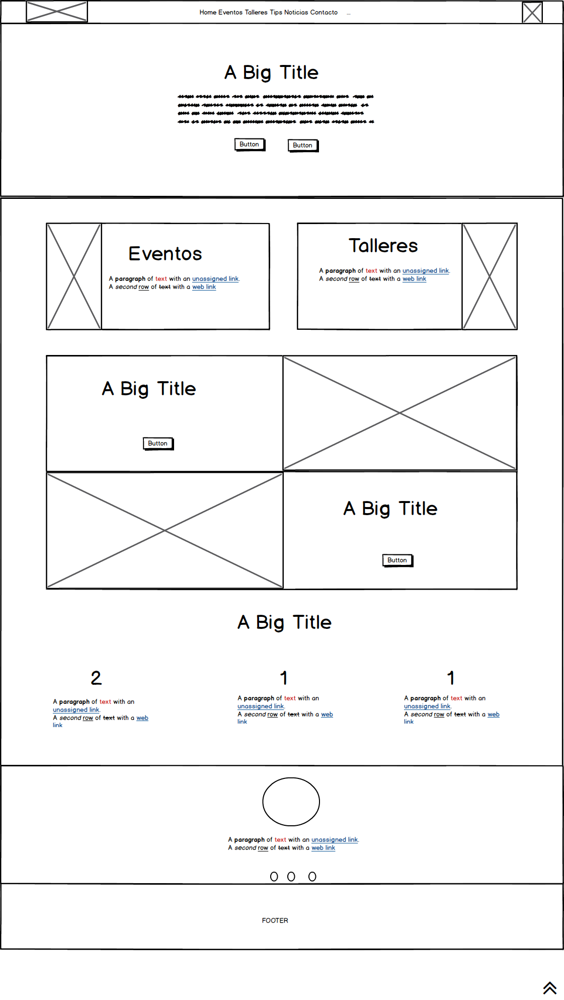
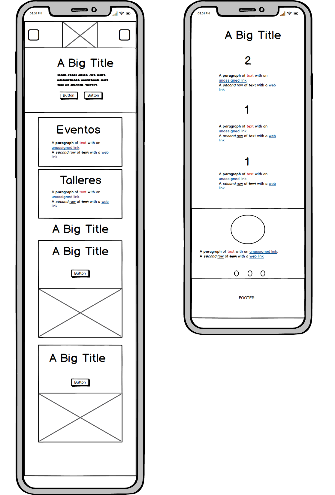

link: https://kuveee.github.io/vidaSanaEnLaComuna/

**Tema**
	
- Vida Sana de la comuna

**Requerimientos del sitio**

- Debe contener como mínimo secciones de eventos deportivos, tips
 nutricionales, recetas sanas, talleres y clases en plazas y contacto.
- Ser responsivo
- Contener información original

**Objetivos UX**

- **Publico objetivo** jóvenes/adultos interesados en cambiar su estilo de vida a saludable.
- En la pagina home al ir navegando se podra resumen e items que redirigen a las paginas especificas.

**Tipo de layout**
	
- 1 a 2 columna Con bootstrap

**Objetivos UI**

- **Fuentes**: Sacadas de Google Fonts.
	- Títulos: Josefin Sans
	- Párrafos: Open sans

- **Colores**:
	-  Fondo Body y navbar: #ebe7e4;
		
	- Fondo iconos: (139,179,182);
		
	- Fondo iconos: (139,179,182);
	- Color letras: #212529

- **Iconos**:

	 - Font Awesome

- **Imágenes**:

	- Sacadas de pagina oficial de Municipalidad Quilicura y sus redes sociales.
 
	
- **Estructura HTML**:
   Primera sección: Navbar
   Segunda sección: Header
   Tercera sección: Talleres y eventos
   Cuarta sección: Nutrición (Recetas)
   Quinta sección: Datos
   sexta sección: Comentarios 
   Septima sección: Footer

- **Clases CSS**:

- Sección 1:
	
	- navbar
	- navbar-brand
		
	- navbar-brand--secundary

- Sección 2:
- 	header-vidasana

- Sección 3:
	
	- lessons
	- lessons__inner
	- lessons__img__left
	- lessons__inner__right
	- lessons__inner__img
	

- Sección 4: 
	- nutrition
	- nutrition__inner
	- nutrition__inner_img-right
	- nutrition__inner_img-left

- Sección 5:

	- 	achievements
	- 	achievements__inner
	- 	achievements__inner__mov
	- 	achievements__inner-icon
	- 	svg-inline--fa
	- 	svg-inline--fa-2
	- 	svg-inline--fa-3

- Sección 6:
	- #testimonials
	- carousel-inner
	- carousel-item

-Sección 7: 
	- footer
	- footer__form
	- footer__inner
	- footer__inner-icon
	- footer__inner-icon--left
	- footer__inner-icon--right
	- footer__secundary
	
- **Estructura de directorio**: 
	- index
	- README
	- assets/
		- css/
		- fonts/
		- icons/
		- img/
		- js/

**Sketch**

